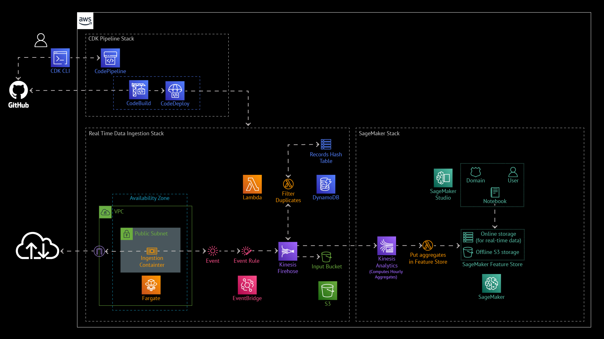

# MLOps Realtime Data Ingestion
An end-to-end realtime machine learning pipeline on AWS including:
* realtime data ingestion into SageMaker Feature Store
* data ETL
* model training & validation
* model deployment
* model monitoring

## To Dos & Improvements
* __Amazon Kinesis Data Analytics__ is legacy and should be replaced by a combination of __Amazon Kinesis Data Stream__ & __Amazon Managed Service for Apache Flink__

## The Data
For this project, we decided to ingest blockchain transactions from the blockchain.com API (see documentation [here](https://www.blockchain.com/explorer/api)). 
We focus on 3 simple metrics:
* The total number of transactions
* The total amount of transaction fees
* The average amount of transaction fees

These metrics are computed per minute. Although it might not be the best window period to analyze blockchain 
transactions, it allows us to quickly gather a lot of data points in a short period of time, avoiding to run the demo 
for too long which has an impact on the AWS billing.
## Architecture
## The Full Architecture

## Near Real Time Data Ingestion Architecture
At a high level, the data are ingested as follow:
1. A container running on AWS Fargate polls the data and writes them to EventBridge
2. EventBridge sends the data to Kinesis Data Firehose
3. Kinesis Data Firehose streams the data to Kinesis Data Analytics
4. Kinesis Data Analytics computes the chosen metrics per minute and writes them to SageMaker Feature Store

See [this documentation](./doc/INGESTION.md) for more details.

## MLOps Architecture

## What are the Prerequisites?
The list below is for _Windows_ environment
* The AWS CLI ([documentation](https://docs.aws.amazon.com/cli/latest/userguide/getting-started-install.html))  
* Docker Desktop ([Documentation](https://docs.docker.com/desktop/windows/install/))  
* NPM and Node.js ([Documenttaion](https://docs.npmjs.com/downloading-and-installing-node-js-and-npm))
* The AWS CDK: `npm install -g aws-cdk`
* Configure your programmatic access to AWS for the CLI (see instructions [here](https://docs.aws.amazon.com/cdk/v2/guide/getting_started.html#getting_started_auth)).
## Documentation
Most of the architecture is fully automated through the CDK. 
You do not have much to configure and can directly play with the application and watch it ingest and aggregate the data in near real time. Once you have ingested some data you can start to train a forecasting model by running the corresponding pipeline and see the entire MLOps process automation.
* [Deploy the Environment](./doc/DEPLOYMENT.md)
* [The Data Ingestion](./doc/INGESTION.md)
* [The MLOps Pipeline](./doc/MLOPS.md)
* [Delete the Entire Project](./doc/DELETION.md)
## Cost
This demo deploys many services (e.g. Fargate, DynamoDB, Kinesis Firehose, Kinesys Analytics) and must be run for 
several days to collect enough data to be able to start training a model. This demo do generate costs which could be 
expensive, depending on your budget. The full demo costs about $850 per month in the Ireland region.
